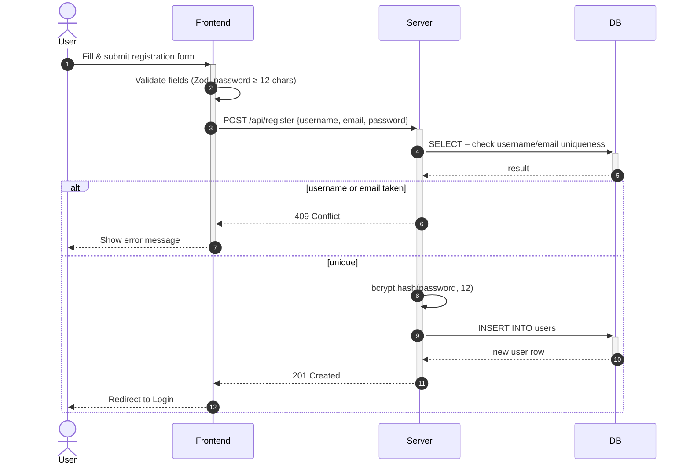

## UC-1: Register Account – Sequence Diagram

```mermaid
sequenceDiagram
    autonumber
    actor User
    participant Frontend
    participant Server
    participant DB

    User->>+Frontend: Fill & submit registration form
    Frontend->>Frontend: Validate fields (Zod, password ≥ 12 chars)
    Frontend->>+Server: POST /api/register {username, email, password}
    Server->>+DB: SELECT – check username/email uniqueness
    DB-->>-Server: result

    alt username or email taken
        Server-->>Frontend: 409 Conflict
        Frontend-->>-User: Show error message
    else unique
        Server->>Server: bcrypt.hash(password, 12)
        Server->>+DB: INSERT INTO users
        DB-->>-Server: new user row
        Server-->>-Frontend: 201 Created
        Frontend-->>User: Redirect to Login
    end
```
