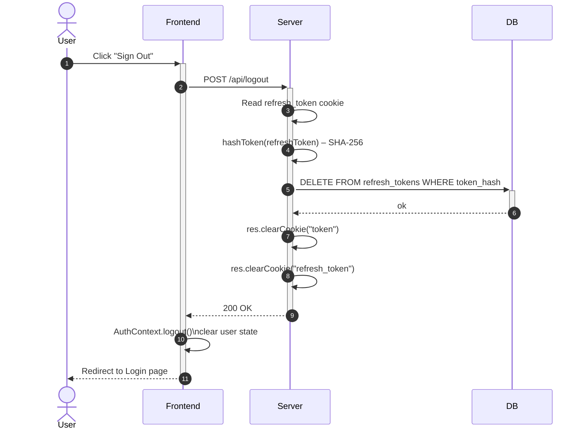

## UC-10: User Logout – Sequence Diagram

```mermaid
sequenceDiagram
    autonumber
    actor User
    participant Frontend
    participant Server
    participant DB

    User->>+Frontend: Click "Sign Out"
    Frontend->>+Server: POST /api/logout
    Server->>Server: Read refresh_token cookie
    Server->>Server: hashToken(refreshToken) – SHA-256

    Server->>+DB: DELETE FROM refresh_tokens WHERE token_hash
    DB-->>-Server: ok

    Server->>Server: res.clearCookie("token")
    Server->>Server: res.clearCookie("refresh_token")
    Server-->>-Frontend: 200 OK

    Frontend->>Frontend: AuthContext.logout()\nclear user state
    Frontend-->>-User: Redirect to Login page
```
