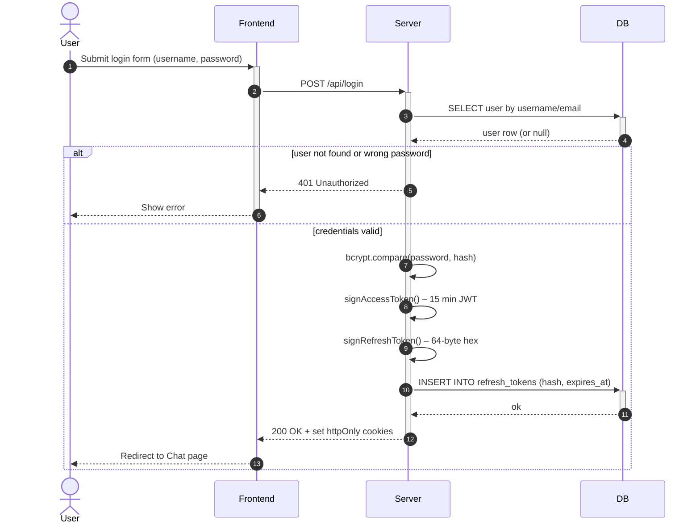

## UC-2: User Login – Sequence Diagram

```mermaid
sequenceDiagram
    autonumber
    actor User
    participant Frontend
    participant Server
    participant DB

    User->>+Frontend: Submit login form (username, password)
    Frontend->>+Server: POST /api/login
    Server->>+DB: SELECT user by username/email
    DB-->>-Server: user row (or null)

    alt user not found or wrong password
        Server-->>Frontend: 401 Unauthorized
        Frontend-->>-User: Show error
    else credentials valid
        Server->>Server: bcrypt.compare(password, hash)
        Server->>Server: signAccessToken() – 15 min JWT
        Server->>Server: signRefreshToken() – 64-byte hex
        Server->>+DB: INSERT INTO refresh_tokens (hash, expires_at)
        DB-->>-Server: ok
        Server-->>-Frontend: 200 OK + set httpOnly cookies
        Frontend-->>User: Redirect to Chat page
    end
```
