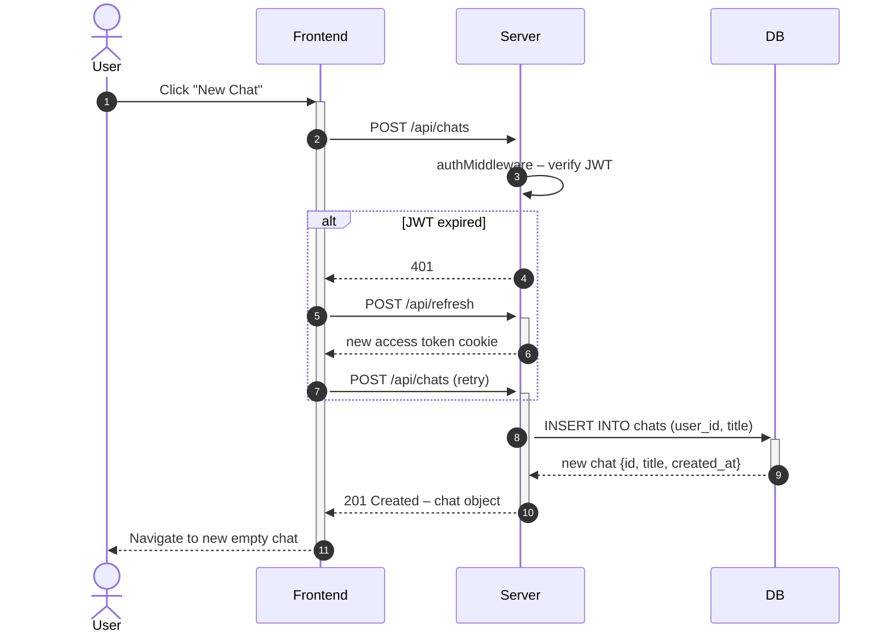

## UC-3: Create New Chat Session – Sequence Diagram

```mermaid
sequenceDiagram
    autonumber
    actor User
    participant Frontend
    participant Server
    participant DB

    User->>+Frontend: Click "New Chat"
    Frontend->>+Server: POST /api/chats
    Server->>Server: authMiddleware – verify JWT

    alt JWT expired
        Server-->>Frontend: 401
        Frontend->>+Server: POST /api/refresh
        Server-->>-Frontend: new access token cookie
        Frontend->>+Server: POST /api/chats (retry)
    end

    Server->>+DB: INSERT INTO chats (user_id, title)
    DB-->>-Server: new chat {id, title, created_at}
    Server-->>-Frontend: 201 Created – chat object
    Frontend-->>-User: Navigate to new empty chat
```
