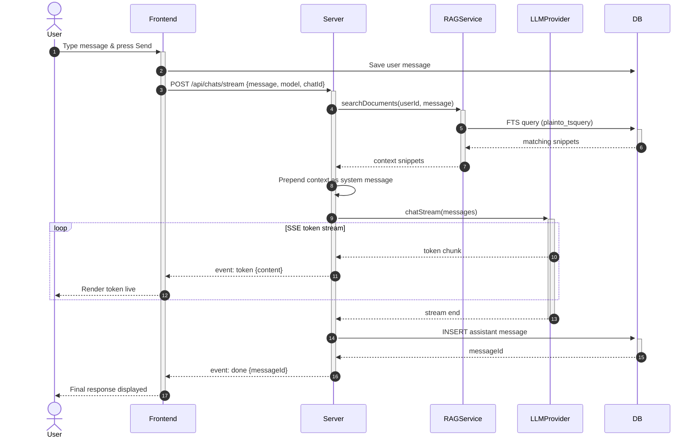

## UC-4: Send Message and Stream AI Response – Sequence Diagram

```mermaid
sequenceDiagram
    autonumber
    actor User
    participant Frontend
    participant Server
    participant RAGService
    participant LLMProvider
    participant DB

    User->>+Frontend: Type message & press Send
    Frontend->>+DB: Save user message
    Frontend->>+Server: POST /api/chats/stream {message, model, chatId}

    Server->>+RAGService: searchDocuments(userId, message)
    RAGService->>+DB: FTS query (plainto_tsquery)
    DB-->>-RAGService: matching snippets
    RAGService-->>-Server: context snippets

    Server->>Server: Prepend context as system message

    Server->>+LLMProvider: chatStream(messages)
    activate LLMProvider

    loop SSE token stream
        LLMProvider-->>Server: token chunk
        Server-->>Frontend: event: token {content}
        Frontend-->>User: Render token live
    end

    LLMProvider-->>-Server: stream end
    deactivate LLMProvider

    Server->>+DB: INSERT assistant message
    DB-->>-Server: messageId
    Server-->>-Frontend: event: done {messageId}
    Frontend-->>-User: Final response displayed
```
