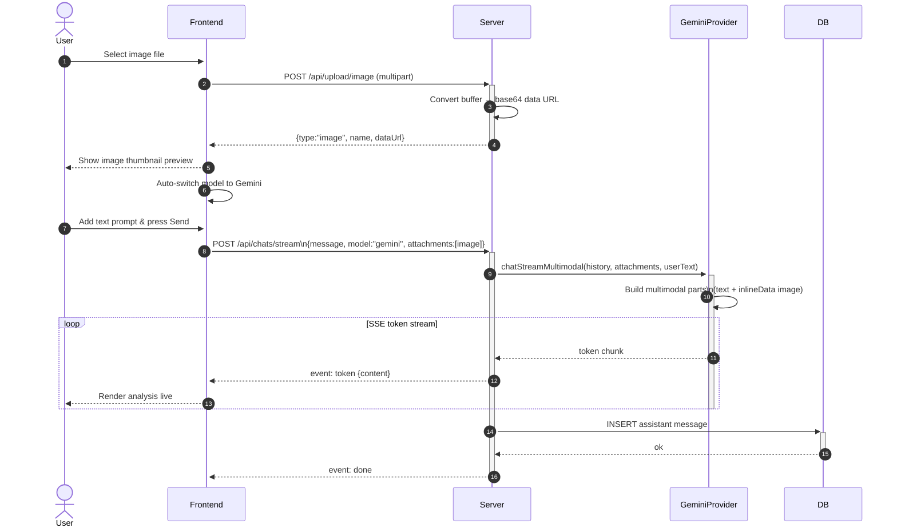

## UC-5: Upload and Analyze Images – Sequence Diagram

```mermaid
sequenceDiagram
    autonumber
    actor User
    participant Frontend
    participant Server
    participant GeminiProvider
    participant DB

    User->>+Frontend: Select image file
    Frontend->>+Server: POST /api/upload/image (multipart)
    Server->>Server: Convert buffer → base64 data URL
    Server-->>-Frontend: {type:"image", name, dataUrl}
    Frontend-->>User: Show image thumbnail preview
    Frontend->>Frontend: Auto-switch model to Gemini

    User->>Frontend: Add text prompt & press Send
    Frontend->>+Server: POST /api/chats/stream\n{message, model:"gemini", attachments:[image]}
    Server->>+GeminiProvider: chatStreamMultimodal(history, attachments, userText)
    activate GeminiProvider
    GeminiProvider->>GeminiProvider: Build multimodal parts\n(text + inlineData image)

    loop SSE token stream
        GeminiProvider-->>Server: token chunk
        Server-->>Frontend: event: token {content}
        Frontend-->>User: Render analysis live
    end

    deactivate GeminiProvider
    Server->>+DB: INSERT assistant message
    DB-->>-Server: ok
    Server-->>-Frontend: event: done
```
