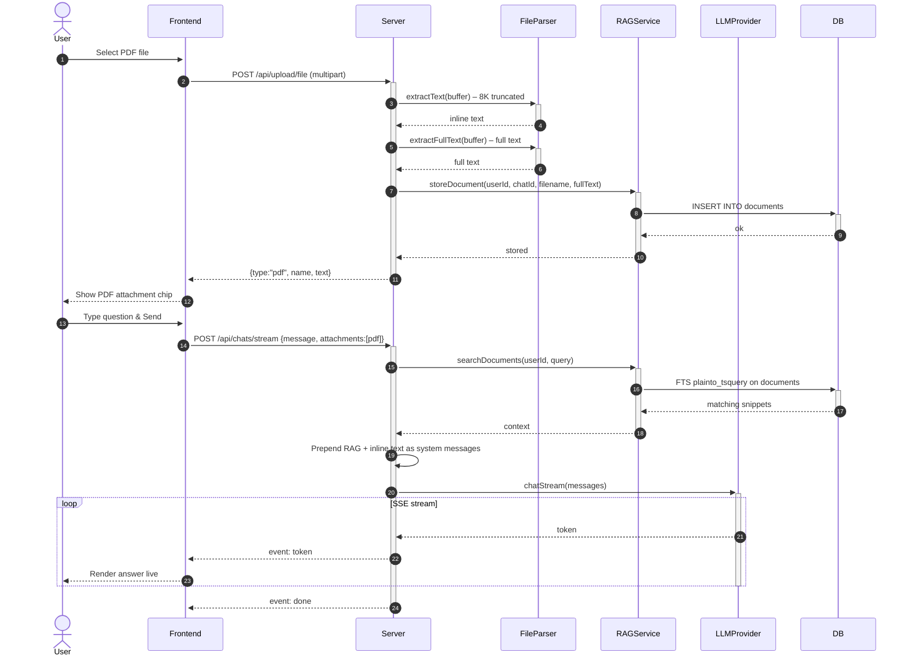

## UC-6: Upload and Query PDF Documents – Sequence Diagram

```mermaid
sequenceDiagram
    autonumber
    actor User
    participant Frontend
    participant Server
    participant FileParser
    participant RAGService
    participant LLMProvider
    participant DB

    User->>+Frontend: Select PDF file
    Frontend->>+Server: POST /api/upload/file (multipart)
    Server->>+FileParser: extractText(buffer) – 8K truncated
    FileParser-->>-Server: inline text
    Server->>+FileParser: extractFullText(buffer) – full text
    FileParser-->>-Server: full text
    Server->>+RAGService: storeDocument(userId, chatId, filename, fullText)
    RAGService->>+DB: INSERT INTO documents
    DB-->>-RAGService: ok
    RAGService-->>-Server: stored
    Server-->>-Frontend: {type:"pdf", name, text}
    Frontend-->>User: Show PDF attachment chip

    User->>Frontend: Type question & Send
    Frontend->>+Server: POST /api/chats/stream {message, attachments:[pdf]}
    Server->>+RAGService: searchDocuments(userId, query)
    RAGService->>+DB: FTS plainto_tsquery on documents
    DB-->>-RAGService: matching snippets
    RAGService-->>-Server: context
    Server->>Server: Prepend RAG + inline text as system messages
    Server->>+LLMProvider: chatStream(messages)

    loop SSE stream
        LLMProvider-->>Server: token
        Server-->>Frontend: event: token
        Frontend-->>User: Render answer live
    end

    deactivate LLMProvider
    Server-->>-Frontend: event: done
```
