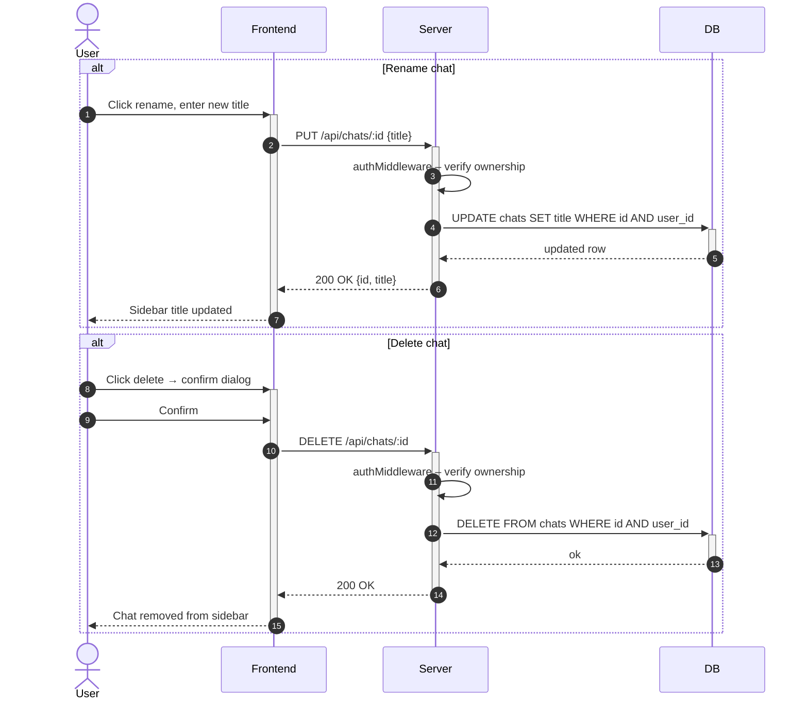

## UC-7: Manage Chat History (Rename / Delete) – Sequence Diagram

```mermaid
sequenceDiagram
    autonumber
    actor User
    participant Frontend
    participant Server
    participant DB

    alt Rename chat
        User->>+Frontend: Click rename, enter new title
        Frontend->>+Server: PUT /api/chats/:id {title}
        Server->>Server: authMiddleware – verify ownership
        Server->>+DB: UPDATE chats SET title WHERE id AND user_id
        DB-->>-Server: updated row
        Server-->>-Frontend: 200 OK {id, title}
        Frontend-->>-User: Sidebar title updated
    end

    alt Delete chat
        User->>+Frontend: Click delete → confirm dialog
        User->>Frontend: Confirm
        Frontend->>+Server: DELETE /api/chats/:id
        Server->>Server: authMiddleware – verify ownership
        Server->>+DB: DELETE FROM chats WHERE id AND user_id
        DB-->>-Server: ok
        Server-->>-Frontend: 200 OK
        Frontend-->>-User: Chat removed from sidebar
    end
```
