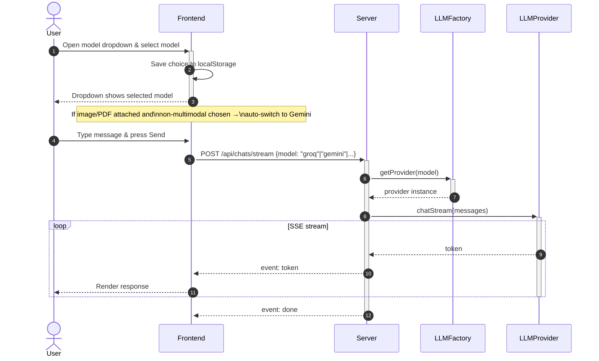

## UC-8: Select AI Provider and Model – Sequence Diagram

```mermaid
sequenceDiagram
    autonumber
    actor User
    participant Frontend
    participant Server
    participant LLMFactory
    participant LLMProvider

    User->>+Frontend: Open model dropdown & select model
    Frontend->>Frontend: Save choice to localStorage
    Frontend-->>-User: Dropdown shows selected model

    Note over Frontend: If image/PDF attached and\nnon-multimodal chosen →\nauto-switch to Gemini

    User->>+Frontend: Type message & press Send
    Frontend->>+Server: POST /api/chats/stream {model: "groq"|"gemini"|...}
    Server->>+LLMFactory: getProvider(model)
    LLMFactory-->>-Server: provider instance

    Server->>+LLMProvider: chatStream(messages)

    loop SSE stream
        LLMProvider-->>Server: token
        Server-->>Frontend: event: token
        Frontend-->>User: Render response
    end

    deactivate LLMProvider
    Server-->>-Frontend: event: done
```
