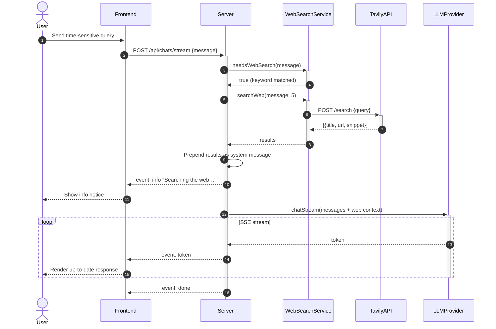

## UC-9: Perform Web Search for Real-time Info – Sequence Diagram

```mermaid
sequenceDiagram
    autonumber
    actor User
    participant Frontend
    participant Server
    participant WebSearchService
    participant TavilyAPI
    participant LLMProvider

    User->>+Frontend: Send time-sensitive query
    Frontend->>+Server: POST /api/chats/stream {message}

    Server->>+WebSearchService: needsWebSearch(message)
    WebSearchService-->>-Server: true (keyword matched)

    Server->>+WebSearchService: searchWeb(message, 5)
    WebSearchService->>+TavilyAPI: POST /search {query}
    TavilyAPI-->>-WebSearchService: [{title, url, snippet}]
    WebSearchService-->>-Server: results

    Server->>Server: Prepend results as system message
    Server-->>Frontend: event: info "Searching the web…"
    Frontend-->>User: Show info notice

    Server->>+LLMProvider: chatStream(messages + web context)

    loop SSE stream
        LLMProvider-->>Server: token
        Server-->>Frontend: event: token
        Frontend-->>User: Render up-to-date response
    end

    deactivate LLMProvider
    Server-->>-Frontend: event: done
```
